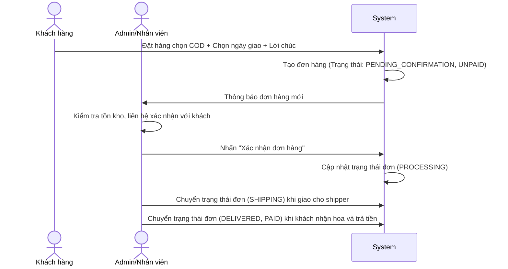
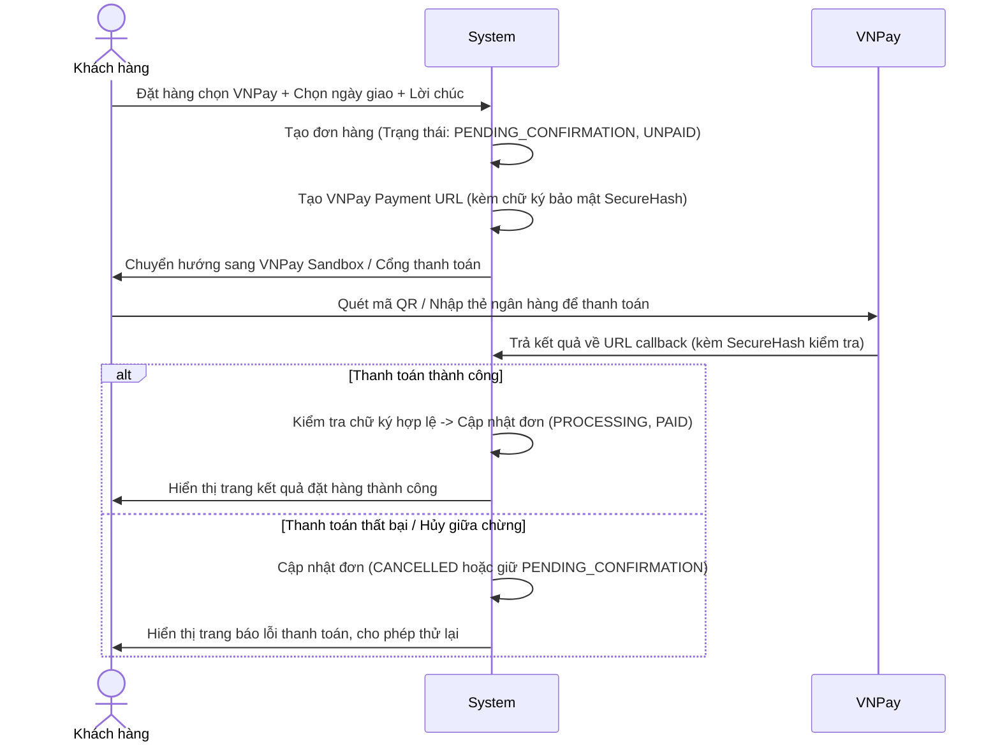

# Tài liệu nghiệp vụ hệ thống bán hoa tươi (Flower E-Commerce Spec)

Tài liệu này mô tả chi tiết các nghiệp vụ, luồng xử lý và quy tắc nghiệp vụ (Business Rules) áp dụng cho hệ thống website bán hoa tươi trực tuyến.

---

## 1. Vai trò trong hệ thống (User Roles)

Hệ thống quản lý 2 nhóm đối tượng sử dụng chính:
1. **Khách hàng (Customer)**:
   - Khách vãng lai (chưa đăng nhập): Xem danh mục hoa, chi tiết hoa, thêm vào giỏ hàng.
   - Khách hàng thành viên (đã đăng nhập): Tiến hành thanh toán, quản lý thông tin giao hàng mặc định, viết thiệp, chọn ngày giao, theo dõi trạng thái đơn hàng đã đặt.
2. **Quản trị viên (Admin)**:
   - Xem thống kê doanh thu, số lượng đơn hàng, số lượng khách hàng.
   - Quản lý danh mục hoa, quản lý sản phẩm (thêm/sửa/xóa hoa, cập nhật tồn kho).
   - Quản lý đơn hàng: Xác nhận đơn hàng COD, cập nhật trạng thái thanh toán, cập nhật trạng thái giao hàng, hủy đơn hàng lỗi.

---

## 2. Đặc thù nghiệp vụ ngành hoa tươi

Khác với các mặt hàng TMĐT thông thường (quần áo, đồ điện tử), sản phẩm hoa tươi có một số quy tắc đặc thù:
- **Thời gian giao hàng (Delivery Schedule)**: Khách hàng phải chọn Ngày giao hàng và Khung giờ giao hàng mong muốn khi đặt hoa (để đảm bảo hoa tươi mới khi nhận).
- **Lời nhắn trên thiệp (Greeting Card Message)**: Đi kèm mỗi bó hoa thường là thiệp chúc mừng. Hệ thống cần cho phép khách chọn loại thiệp (Thiệp sinh nhật, thiệp chúc mừng khai trương, chia buồn...) và nhập nội dung lời nhắn.
- **Phân loại theo Dịp (Occasions)**: Hoa tươi được tìm kiếm nhiều nhất theo mục đích sử dụng (Sinh nhật, Khai trương, Tình yêu, Lễ cưới, Chia buồn) bên cạnh phân loại theo loại hoa (Hoa hồng, Hoa hướng dương, Hoa ly...).
- **Tồn kho hoa**: Hoa là mặt hàng có hạn sử dụng ngắn. Quản lý tồn kho giúp Admin kiểm soát lượng hoa có sẵn trong ngày để tránh nhận đơn vượt quá năng lực đáp ứng.

---

## 3. Quy trình đặt hàng và vòng đời Đơn hàng (Order Lifecycle)

### 3.1. Các trạng thái Đơn hàng (Order Status)
- **Chờ xác nhận (PENDING_CONFIRMATION)**: Đơn hàng COD mới đặt, hoặc đơn hàng VNPay nhưng thanh toán chưa thành công/bị hủy giữa chừng.
- **Đang xử lý (PROCESSING)**: Đơn hàng đã được thanh toán online thành công hoặc đã được Admin xác nhận (đối với đơn COD). Nhân viên bắt đầu cắm hoa.
- **Đang giao (SHIPPING)**: Hoa đã được bàn giao cho shipper để chuyển đi.
- **Đã hoàn thành (DELIVERED)**: Khách đã nhận hoa thành công.
- **Đã hủy (CANCELLED)**: Khách hàng hủy trước khi xử lý hoặc Admin hủy đơn do hết hoa/lỗi thanh toán.

### 3.2. Trạng thái thanh toán (Payment Status)
- **Chưa thanh toán (UNPAID)**: Mặc định cho COD khi mới đặt, hoặc đơn thanh toán online chưa hoàn tất.
- **Đã thanh toán (PAID)**: Đơn hàng đã được thanh toán thành công qua cổng VNPay.
- **Đã hoàn tiền (REFUNDED)**: Áp dụng khi đơn hàng đã thanh toán online nhưng bị hủy và Admin thực hiện hoàn tiền cho khách.

---

## 4. Luồng thanh toán (Payment Flows)

### 4.1. Thanh toán COD (Thanh toán khi nhận hàng)

### 4.2. Thanh toán VNPay (Thanh toán trực tuyến)

